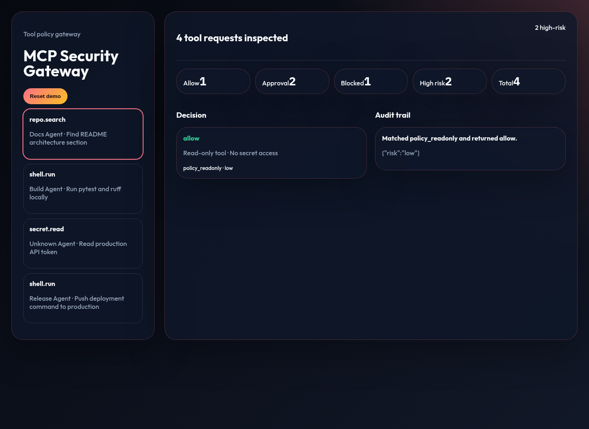
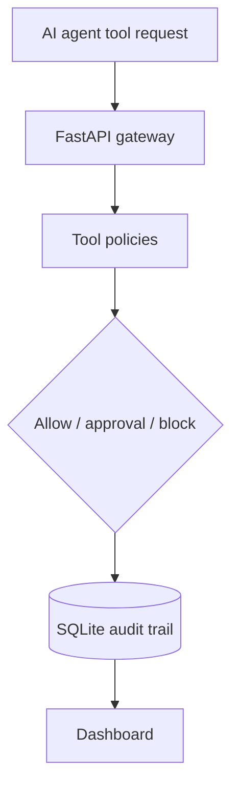

# MCP Security Gateway

Local-first MCP security gateway for policy-checking tool calls, risk scoring, approvals, and audit trails.





## What Works Today

- Deterministic MCP-style tool requests for read-only, shell, deployment, and secret-access scenarios.
- Policy decisions that allow, block, or require human approval.
- Risk levels, matched policy names, reasons, and audit events.
- Local FastAPI API, SQLite storage, and polished browser dashboard.

## Quick Start

```bash
uv run --extra dev pytest
uv run mcp-security-gateway
```

Open `http://127.0.0.1:8050`.

## Current Limits

This is a local portfolio gateway, not a live MCP proxy. It models the policy and audit boundary without connecting to real secrets or production tools.
