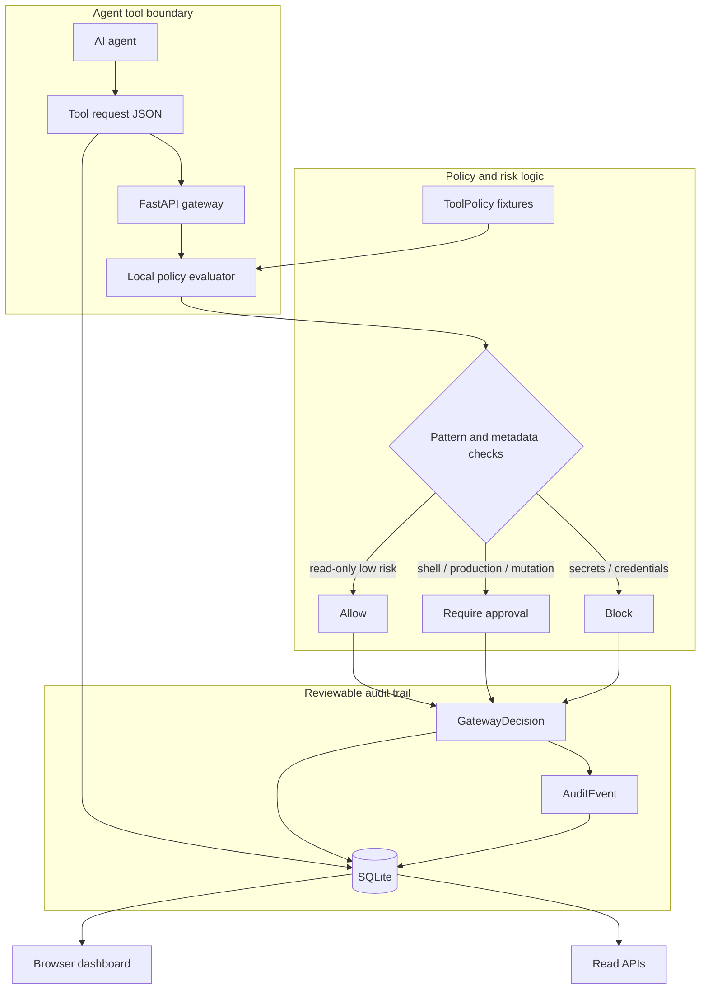

# MCP Security Gateway

Local-first MCP security gateway for policy-checking tool calls, risk scoring, approvals, and audit trails.


The project models the boundary an AI agent should cross before it can execute a tool. It accepts MCP-style tool requests, matches them against local policies, produces allow/approval/block decisions, and stores an audit trail in SQLite. The demo is intentionally offline: it does not connect to real secrets, shell tools, or production systems.

## What Works Today

- Deterministic MCP-style tool requests for read-only, shell, deployment, and secret-access scenarios.
- A live `POST /api/requests/evaluate` endpoint that accepts a new local tool request and persists the resulting decision.
- Policy decisions that allow, block, or require human approval based on tool name, environment metadata, and sensitive/destructive wording.
- Risk levels, matched policy names, reasons, and audit events for every request.
- Local FastAPI API, SQLite storage, and polished browser dashboard.

## Dashboard

The dashboard shows request volume, approval/block rates, high-risk decisions, and the selected request's audit trail. The sidebar includes a local evaluation form with a sample production shell request so reviewers can see the gateway make a fresh decision instead of only browsing fixtures.

## Architecture



## API Surface

- `GET /api/health` - readiness check.
- `GET /api/summary` - counts for allowed, approval-required, blocked, and high-risk requests.
- `GET /api/policies` - local policy fixtures.
- `GET /api/requests` - evaluated requests ordered by request time.
- `GET /api/requests/{request_id}` - request, decision, and audit events.
- `POST /api/requests/evaluate` - evaluate and persist a new local tool request.
- `POST /api/demo/reset` - reset deterministic demo data.

Example local request:

```json
{
  "agent_name": "Release Agent",
  "tool_name": "shell.run",
  "input_summary": "Deploy the latest policy bundle to production",
  "metadata": {
    "environment": "production",
    "change_ticket": "SEC-1842"
  }
}
```

The gateway returns a `require_approval` decision with high risk because shell execution plus production metadata should not be allowed automatically.

## Policy Logic

The evaluator is deterministic and deliberately reviewable:

- `repo.search` is allowed as a low-risk read-only developer tool.
- `shell.run` requires approval by default and escalates to high risk when the input mentions deployment, production, deletion, writing, or similar mutation language.
- `secret.read` and secret-like requests are blocked before execution.
- Unknown tools require approval instead of being silently allowed.
- Every decision includes matched policy, reasons, human-review flag, and audit events.

## Quick Start

```bash
uv run --extra dev pytest
uv run mcp-security-gateway
```

Open `http://127.0.0.1:8050` and try the sample request in the evaluation panel.

## Development

```bash
uv run --extra dev ruff check src tests
uv run --extra dev ruff format --check src tests
uv run python -m compileall -q src tests
uv run --extra dev pytest tests/ --cov=mcp_security_gateway --cov-report=term-missing
```

## Current Limits

This is a local portfolio gateway, not a live MCP proxy. It models the policy and audit boundary without connecting to real secrets, running shell commands, or enforcing policy in front of a deployed MCP server. Live proxying, authentication, signed approvals, and organization policy sync would be natural next steps.
