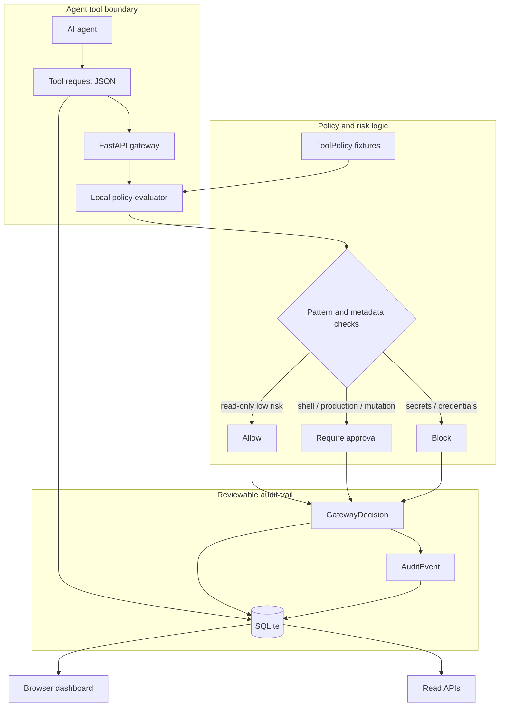

# Architecture

The project demonstrates reviewable MCP tool-call policy enforcement with deterministic local evaluation and no real secret access.

## Runtime Flow

1. An agent proposes a tool call as JSON.
2. FastAPI validates the request with Pydantic.
3. The repository-backed evaluator matches the tool name against local policies.
4. Secret-like, production, shell, and destructive-operation signals escalate risk.
5. The gateway stores the request, decision, and audit events in SQLite.
6. The dashboard and read APIs show the reviewable result.

## Boundary Choices

The gateway does not execute tools. That is intentional: the hiring signal is the policy boundary, auditability, and deterministic tests around allow/approval/block decisions. A production MCP proxy would add authentication, signed approvals, and enforcement hooks before real tool invocation.
