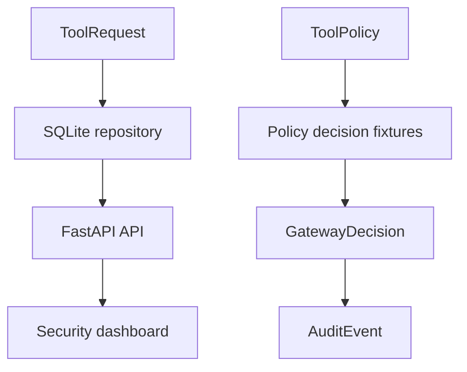

# Architecture

```mermaid
flowchart TB
    Request[ToolRequest] --> Repo[SQLite repository]
    Policy[ToolPolicy] --> Engine[Policy decision fixtures]
    Engine --> Decision[GatewayDecision]
    Decision --> Audit[AuditEvent]
    Repo --> API[FastAPI API]
    API --> UI[Security dashboard]
```

The project demonstrates reviewable MCP tool-call policy enforcement with deterministic fixtures and no real secret access.
